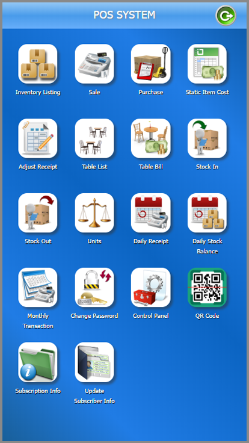
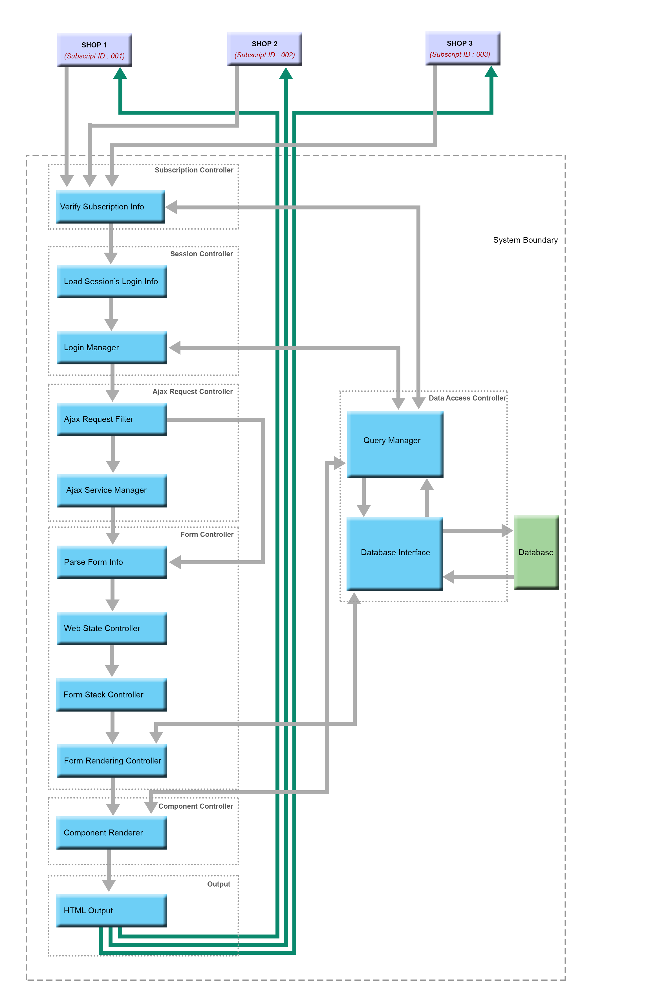

# Cobra : Web-Based Stateful POS System
This project is to demonstrate how to develop interactive stateful POS application using web technology.
The UI design of the application is based on the iOS and it is compatible across all size of devices.
Even though the application is based on the web technology, it can maintain state of appication and behave
like a mobile application.

__*Demo Link*__ : https://testpos.gshopzone.com/?_e=RTgxNjBDOTRDNEQzM0I0QjQ0NjU2MzRFRkZGOEYyRkVBQUFBQUFBQTExMTExMTExMTExMTExMTExMTExMTExMQ%3D%3D

### Output Design
\

\

### Architectural Design
\


### Project Overview
- Using CSS Styles to design the UI that similar to mobile app and compatible across various device size.
- Saving web state and form stack on the URL.
- Full rendering and partial rendering of Form Control.
- Centralize AJAX service for better maintainability.
- Logical Partitioning of Database.
- Updating of Database using Base64Encoded JSON Data.
- Dynamic Font Loading Mechanism.
- Dynamic Script Loading and CSS Loading Mechanism to load only necessary script file and CSS files.
- Duplicate Resource Detecting Mechanism to eliminate loading same resource multiple times.
- Dependencies awaiting mechanism to eliminate javascript error due to loading order.
- Widget Access Security for strict widgets.
- Multiple language controlling mechanism.
- Printing using Web Print technology.


### Application Features
###### Multiple Subscription Cabability
- Allow multiple subscriptions each of which are totally isolated.
- Data from all subscriptions are reside within the same database and logically partitioned.
- Each subscription maintain it's own system settings and user accounts.
- It allows multiple users with different roles for each subscription.

###### Support Multiple Languages
- System allow multiple lanugages.
- It allow to define different system font for different language.
- System loads only necessary fonts for the selected language.

###### Support Sub-unit feature
- It supports Sub-unit features with custom relationship. (e.g. 10 Pcs per 1 Packet)
- Conversion between Sub-unit and Major unit is handle automatically by system.

###### Support Multiple Receipt Types
- User can issue Sales Receipt, Purchase Receipt, Stock-In Receipt and Stock-Out Receipt.
- To minimized the concurrency issue, system uses on-the-fly validation mechanism.
- System also allow to issue pending sale receipt for each table for restaurants.

###### Support Reporting
- System can generate daily report and monthly report.
- Profit and loss is based on the latest purchase price of item as cost.
- Stock Balance is calculate on-the-fly and it can produce report with stock cost.
- System can generate reports as of any date.

###### Support Printing
- System is compatible with certain receipt printers that support Web Print Technology.
- Currently it supports, __*Star Mc-Print2*__, __*Star Mc-Print3*__, __*EPSON TM-T88VI*__, __*EPSON TM-M30*__ and __*EPSON TM-M10*__ printers.

###### Support Customization of Settings
- Add / Remove users and change password.
- Customizing Transaction Settings.
- Customizing Security Settings.
- Customizing Printer Settings.
- Customizing Receipt Layout Settings.
- Customizing Application Settings and Installer Settings.


### Database Tables
Database has three types of tables Control Table, Transaction Tables and Log Tables.
###### Control Tables
__*Admin_EServiceParam*__ \
This table store parameter for creating a new subscription. 
it only use when creating new subscriptions.

__*Admin_FieldInfo*__ \
This table store predefined properties of a form control. 
System will populate the properties of form control with the values from this table at run time using reflection.

__*Admin_FormInfo*__ \
This table store base information of a form control. 
System will instantiate the form control object using data from this table.

__*Admin_InputInfo*__ \
This table store input group information that use in some form which has multiple input boxes.
System use data from this table to generate as series of input boxes.

__*Admin_Keypad*__ \
This table store information of Keypads. 
This table helps to customize the layout of Keypad without modifying the code.
This table is logically partitioned by language and system will retrieve only those records belongs to active language.

__*Admin_Language*__ \
This table store language specific information. 

__*Admin_Message*__ \
All application related messages for Message Box are stored in this table.
This table is logically partitioned by language and system will retrieve only those records which is belong to active language.

__*Admin_Routing*__ \
This table stored routing information. Currently, it has only single route record. 

__*Admin_Session*__ \
This table stored active session information.

__*Admin_Setting*__ \
This table store all application settings. 
The setting table is logically partitioned by Subscription ID.

__*Admin_Text*__ \
All application related texts and labels are stored in this table.
This table is logically partitioned by language and system will retrieve only those records which is belong to active language.

__*Admin_TimeZone*__ \
This table store Time Zone related information.

__*Admin_ToolBar*__ \
This table store various type of tool bar information which uses in different forms.

__*Admin_UrlRewrite*__ \
This table stored Url rewriting information. Currently, it has only single url rewrite record. 

__*Admin_User*__ \
This table store user specific information for all subscription.
This table is logically partitioned by Subscription ID and system will check only users that belong to particular subscription.

__*Admin_Widgets*__ \
This table store information of all Widgets that can use in system.
The widget is an entry point to a particular Form Control. 
TTo access strict Widgets, system will request PIN Code to ensure security of Widget usage.

__*Data_AppManifest*__ \
This table store application manifest related information.
System will generate iOS web clip or application manifest JSON file using information from this table.

__*Data_ComponentSubscription*__ \
This table store information about subscribed componenets.
The home screen will render widgets based on the information from this table.

__*Data_DynamicQuery*__ \
This table store queries that use in the application.
Queries has place holders which is replaced with actual value by system runtime.

__*Data_EService*__ \
This table store types of services which support by system. 
Subscription table linked to EService ID in this table to identify the service type.
This table also allow to configure off-site storage of transactional data.

__*Data_Subscriber*__ \
This table store information of subscriber such as name, address and contact no. etc.

__*Data_Subscription*__ \
This is the primary table for subscriptions. System checks the Subscription ID against this table
to determine the validity of subscription and type of service that subscribed.

###### Transactional Tables

__*EData_ItemCatalogue*__ \
This table store the stock item related information.
This table is logically partitioned by Subscription ID and access is limited to its own subscription.

__*EData_Receipt*__ \
This table is master table of receipt related information.
All types of receipts are stored in this table.
This table also logically partitioned by Subscription ID and receipt serial number is base on the particular 
subscription.

__*EData_StakeHolder*__ \
This table store information about customers or supplier. This table linked with 
StakeHolderID of *EData_Receipt* table.

__*EData_StockIncoming*__ \
This table is detail table of the incoming receipt related information. This table linked with
*EData_Receipt* table using ReceiptID.

__*EData_StockOutgoing*__ \
This table is detail table of the outgoing receipt related information. This table linked with
*EData_Receipt* table using ReceiptID.


__*EData_TableList*__ \
This table store restaurant table and table group information.
This table also logically partitioned by Subscription ID and access is limited to its own subscription.

__*EData_Unit*__ \
This table store Unit related information of the stock.
This table also logically partitioned by Subscription ID and access is limited to its own subscription.

###### Log Tables
__*Logging Tables*__

*ELog_ItemCatalogue*, *ELog_Receipt*,*ELog_StockIncoming*, 
*ELog_StockOutgoing*, *ELog_TableList*, *ELog_Unit*,
*Log_AppManifest*, *Log_Setting*, *Log_Subscriber*, *Log_Subsciption*, *Log_User*
are log tables for the corresponding tables.

__*Track_ServiceRequestLog*__ \
This table log the service request activity. 
This information is to measure performance of the server.


### Stored Functions
__*Base64Decode*__ \
This stored function is to decode Base64 String to String.

```SQL
CREATE FUNCTION [dbo].[Base64Decode] ( @Input VARCHAR(MAX) )
 
RETURNS VARCHAR(MAX)
BEGIN
 
DECLARE @DecodedOutput VARCHAR(MAX)
 
set @DecodedOutput = CAST(CAST(N'' AS XML).value('xs:base64Binary(sql:variable("@Input"))', 'VARBINARY(MAX)') AS VARCHAR(MAX))
 
RETURN @DecodedOutput
 
END
```

__*Base64Encode*__ \
This stored function is to encode String to Base64 String.
```SQL
CREATE FUNCTION [dbo].[Base64Encode] ( @Input VARCHAR(MAX) )
RETURNS VARCHAR(MAX)
BEGIN
 
DECLARE @Input1 VARBINARY(MAX)
DECLARE @EncodedOutput VARCHAR(MAX)
 
set @Input1 = CONVERT(varbinary(MAX), @Input)
set @EncodedOutput = CAST(N'' as xml).value('xs:base64Binary(sql:variable("@Input1"))', 'VARCHAR(max)')
 
RETURN @EncodedOutput
 
END
```
__*Modulus11CheckChar*__ \
This stored function is to generate modulus 11 check character.
```SQL
CREATE FUNCTION [dbo].[Modulus11CheckChar] (@DataStr VARCHAR(MAX) )
 
RETURNS VARCHAR(1)
BEGIN
 
DECLARE @CharCode int;
DECLARE @Multiplier  int;
DECLARE @Counter	int = 0;
DECLARE @SumValue int = 0;
DECLARE @MultiplierArray  varchar(10) = '1234567';
DECLARE @CheckCharArray  varchar(11) = 'UCANGFJTRKX';
DECLARE @CheckChar as varchar(1);

WHILE @Counter < Len(@DataStr)
BEGIN
		SET @CharCode = ASCII(Substring(@DataStr,@Counter + 1,1));
		SET @Multiplier  = CONVERT(int, Substring(@MultiplierArray, (7 - (@Counter % 7)),1));

		SET @SumValue += @Multiplier * @CharCode;
		SET @Counter = @Counter + 1;
END;

	  SET @SumValue = @SumValue % 11;
	  SET @SumValue = 11 - @SumValue;

	  SET @CheckChar = SUBSTRING(@CheckCharArray, @SumValue, 1);
	  
	  RETURN @CheckChar
 
END
```

__*UTF8Base64Decode*__ \
This stored function is to decode Base64 String to UTF-8 String.

```SQL
CREATE FUNCTION [dbo].[UTF8Base64Decode] ( @Input NVARCHAR(MAX) )
 
RETURNS NVARCHAR(MAX)
BEGIN
 
DECLARE @BinaryValue VARBINARY(MAX) =   CONVERT(XML, @Input).value('.','varbinary(max)');

DECLARE @IntermediaryValue VARCHAR(MAX) = CONVERT(VARCHAR(MAX), @BinaryValue);

DECLARE @EscapedValue VARCHAR(MAX) = dbo.XMLEscape(@IntermediaryValue,1); 

DECLARE @DecodedOutput NVARCHAR(MAX) = CONVERT(NVARCHAR(MAX), CONVERT(XML, '<?xml version="1.0" encoding="UTF-8"?>' +  @EscapedValue));

SET @DecodedOutput = dbo.UTF8XMLEscape(@DecodedOutput,0);
 
RETURN @DecodedOutput
 
END
```

__*UTF8XMLEscape*__ \
This stored function is to encode/decode xml escape in an UTF-8 String.
```SQL
CREATE FUNCTION [dbo].[UTF8XMLEscape] ( @Input NVARCHAR(MAX), @Escape TinyInt )
 RETURNS NVARCHAR(MAX)
BEGIN
		DECLARE @OutputData NVARCHAR(MAX) = @Input;

		 IF (@Escape = 0)
		 BEGIN
     			SET @OutputData = REPLACE(@OutputData,'&amp;','&');
				SET @OutputData = REPLACE(@OutputData,'&lt;','<');
				SET @OutputData = REPLACE(@OutputData,'&gt;','>');
				SET @OutputData = REPLACE(@OutputData,'&quot;','"');
				SET @OutputData = REPLACE(@OutputData,'&apos;','''');
		 END
		 ELSE
		 BEGIN
				SET @OutputData = REPLACE(@OutputData,'&','&amp;');
				SET @OutputData = REPLACE(@OutputData,'<','&lt;');
				SET @OutputData = REPLACE(@OutputData,'>','&gt;');
				SET @OutputData = REPLACE(@OutputData,'"','&quot;');
				SET @OutputData = REPLACE(@OutputData,'''','&apos;');	
		 END
	
		RETURN @OutputData 
END
```
__*XMLEscape*__ \
This stored function is to encode/decode xml escape in a text string.
```SQL
CREATE FUNCTION [dbo].[XMLEscape] ( @Input VARCHAR(MAX), @Escape TinyInt )
 RETURNS VARCHAR(MAX)
BEGIN
		DECLARE @OutputData VARCHAR(MAX) = @Input;

		 IF (@Escape = 0)
		 BEGIN
     			SET @OutputData = REPLACE(@OutputData,'&amp;','&');
				SET @OutputData = REPLACE(@OutputData,'&lt;','<');
				SET @OutputData = REPLACE(@OutputData,'&gt;','>');
				SET @OutputData = REPLACE(@OutputData,'&quot;','"');
				SET @OutputData = REPLACE(@OutputData,'&apos;','''');
		 END
		 ELSE
		 BEGIN
				SET @OutputData = REPLACE(@OutputData,'&','&amp;');
				SET @OutputData = REPLACE(@OutputData,'<','&lt;');
				SET @OutputData = REPLACE(@OutputData,'>','&gt;');
				SET @OutputData = REPLACE(@OutputData,'"','&quot;');
				SET @OutputData = REPLACE(@OutputData,'''','&apos;');	
		 END
	
		RETURN @OutputData 
END

```

### Stored Procedures
__*ES_CreateSubscription*__ \
This stored procedure is to create new subscriptions.

```SQL
CREATE PROCEDURE [dbo].[ES_CreateSubscription](  
 @EServiceID varchar(100),   
 @ActivationDate Datetime,
 @ExpiryDate Datetime)	

AS
BEGIN	    
	SET NOCOUNT ON;
		
        IF NOT EXISTS(SELECT * FROM Admin_EServiceParam WHERE EServiceID = @EServiceID)
        BEGIN
	        RAISERROR('Invalid EService ID',16,1);
	        RETURN;
        END;
	
        DECLARE @ProductID varchar(50)				= (SELECT ProductID FROM Admin_EServiceParam WHERE EServiceID = @EServiceID);
	DECLARE @ServerID varchar(50)					= (SELECT ServerID FROM Admin_EServiceParam WHERE EServiceID = @EServiceID);
	DECLARE @EditionCode varchar(50)				= (SELECT EditionCode FROM Admin_EServiceParam WHERE EServiceID = @EServiceID);
	DECLARE @EditionSuffix varchar(50)			= (SELECT EditionSuffix FROM Admin_EServiceParam WHERE EServiceID = @EServiceID);	
	DECLARE @AppName varchar(200)				= (SELECT AppName FROM Admin_EServiceParam WHERE EServiceID = @EServiceID);
	DECLARE @ShortName varchar(50)				= (SELECT ShortName FROM Admin_EServiceParam WHERE EServiceID = @EServiceID);
	DECLARE @BackgroundColor varchar(50)		= (SELECT BackGroundColor FROM Admin_EServiceParam WHERE EServiceID = @EServiceID);
	DECLARE @Description varchar(500)			= (SELECT Description FROM Admin_EServiceParam WHERE EServiceID = @EServiceID);
	DECLARE @Icon varchar(500)						= (SELECT Icon FROM Admin_EServiceParam WHERE EServiceID = @EServiceID);
	DECLARE @OrganizationID varchar(200)		= (SELECT OrganizationID FROM Admin_EServiceParam WHERE EServiceID = @EServiceID);
	DECLARE @OrganizationName varchar(500)	= (SELECT OrganizationName FROM Admin_EServiceParam WHERE EServiceID = @EServiceID);
		
	DECLARE @UserID int						= 0;
	DECLARE @LoginID varchar(200)		= 'SYSTEM'

	DECLARE @NewSerial  						INT;		
	DECLARE @NewSubscriptionSerial		VARCHAR(50);
	DECLARE @SubscriptionID					VARCHAR(200);
		
	SET @NewSerial				   = (SELECT ISNULL(Max(Convert(int, Substring(SubscriptionSerial,11,3))),0) + 1 from Data_Subscription where LEFT(SubscriptionSerial,3) = @ProductID AND	SUBSTRING(SubscriptionSerial,5,3) = @ServerID AND SUBSTRING(SubscriptionSerial,9,2) = @EditionCode AND 	SUBSTRING(SubscriptionSerial,15,2) = @EditionSuffix);
	SET @NewSubscriptionSerial = @ProductID + '-' + @ServerID + '-' + @EditionCode + RIGHT(' 000' + Convert(varchar(3), @NewSerial),3) + '-' + @EditionSuffix;
	SET @NewSubscriptionSerial = @NewSubscriptionSerial + '-' + dbo.Modulus11CheckChar(@NewSubscriptionSerial);
	
	SET @SubscriptionID		= NEWID();
	
	INSERT INTO Data_Subscription(UserID, LogInID, SubscriptionID, EServiceID, FrontEndPath, SubscriptionSerial,  Type, Status, ActivationDate, ExpiryDate, SubscriptionRole, SubscriptionAttribute) 
	VALUES (@UserID, @LoginID, @SubscriptionID, @EServiceID, @NewSubscriptionSerial, @NewSubscriptionSerial,  'ANNUAL', 'ACTIVE',  @ActivationDate, @ExpiryDate, '', '');
	
	INSERT INTO Admin_User(SubscriptionID, LoginID, Type, Status, UserRole,  Password) 
	VALUES (@SubscriptionID, "gizmo", 'SUPERADMIN', 'ACTIVE', '#ADMIN;', '96E79218965EB72C92A549DD5A330112');
	
	INSERT INTO Data_AppManifest(SubscriptionID, AppName, ShortName, BackgroundColor, Description, FrontEndIcon, BackEndIcon, OrganizationID, OrganizationName) 
	VALUES (@SubscriptionID, @AppName, @ShortName, @BackgroundColor, @Description, @Icon, @Icon, @OrganizationID, @OrganizationName);

END

```

__*ES_POSChangeItemStatus*__ \
This stored procedure is to change the status of an item or category.

```SQL
CREATE PROCEDURE [dbo].[ES_POSChangeItemStatus]( 
 @SubscriptionID varchar(200), 
 @UserID int,
 @LoginID varchar(200), 
 @AccessInfo varchar(2000),
 @ItemID int,
 @Status varchar(50), 
 @ReturnValue int Output)	
AS
BEGIN	    
	SET NOCOUNT ON;

	DECLARE  @IncomingQuantity decimal;
	DECLARE  @OutgoingQuantity decimal;	
	DECLARE  @OutstandingQuantity decimal;
	DECLARE  @OutstandingInfo varchar(200);
	DECLARE  @OutstandingError varchar(400);
	DECLARE  @QuantativeItem tinyint;

	IF ((@Status <> 'ACTIVE') And EXISTS(SELECT * From EData_ItemCatalogue Where SubscriptionID = @SubscriptionID and Status = 'ACTIVE' and Category = @ItemID))
	BEGIN
			RAISERROR('[#ERROR];err_categorynotempty;Category is Not Empty.',16,1);
			RETURN;
	END

	IF (@Status <> "ACTIVE")
	BEGIN			
				SET @QuantativeItem = (SELECT IIF(EntryType = 'ITEM' AND EntryAttribute <> 'STATIC',1,0) From EData_ItemCatalogue Where SubscriptionID = @SubscriptionID and Status = 'ACTIVE' and ItemID = @ItemID);
				SET  @OutgoingQuantity = ISNULL((SELECT Sum(so.Quantity) FROM EData_Receipt as rc, EData_StockOutgoing as so WHERE rc.SubscriptionID = @SubscriptionID And so.SubscriptionID = @SubscriptionID And rc.ReceiptID = so.ReceiptID and rc.Status = 'ACTIVE' and so.ItemID = @ItemID),0);							
				SET  @IncomingQuantity = ISNULL((SELECT Sum(si.Quantity) FROM EData_Receipt as rc, EData_StockIncoming as si WHERE rc.SubscriptionID = @SubscriptionID And si.SubscriptionID = @SubscriptionID And rc.ReceiptID = si.ReceiptID and rc.Status = 'ACTIVE' and si.ItemID = @ItemID),0);
				SET @OutstandingQuantity = @IncomingQuantity - @OutgoingQuantity;
				
				IF ((@OutstandingQuantity <> 0) AND (@QuantativeItem = 1))
				BEGIN
						SET @OutstandingInfo = '{"quantity":"' + Cast(@OutstandingQuantity as varchar(18))+ '"}'; 
						SET @OutstandingError  = '[#ERROR];err_stocknotempty;$ITEMNAME still have $QUANTITYTEXT in stock.;' + @OutstandingInfo;
						RAISERROR(@OutstandingError,16,1);
						RETURN;
				END
	END
		
	BEGIN TRY		
				INSERT INTO ELog_ItemCatalogue Select GetDate(), @UserID, @LoginID, @AccessInfo, Concat('STATUS->',@Status), EData_ItemCatalogue.* FROM EData_ItemCatalogue Where SubscriptionID = @SubscriptionID And Itemid = @ItemID;
				
				UPDATE EData_ItemCatalogue 
				SET		
							UserID = @UserID,
							LogInID = @LoginID,
							AccessInfo = @AccessInfo,
							Status = @Status 							
				Where 
							SubscriptionID = @SubscriptionID And
							ItemID = @ItemID;														
				Set @ReturnValue = 1;				
	END TRY
	BEGIN CATCH		
			Set @ReturnValue = 0;		
			THROW
	END CATCH
	
END
```

__*ES_POSChangeTableStatus*__ \
This stored procedure is to change the status of an table or table group.
```SQL
CREATE PROCEDURE [dbo].[ES_POSChangeTableStatus]( 
 @SubscriptionID varchar(200), 
 @UserID int,
 @LoginID varchar(200), 
 @AccessInfo varchar(2000),
 @TableID int,
 @Status varchar(50), 
 @ReturnValue int Output)	
AS
BEGIN	    
	SET NOCOUNT ON;

	IF ((@Status <> 'ACTIVE') And EXISTS(SELECT * From EData_TableList Where SubscriptionID = @SubscriptionID AND Status = 'ACTIVE' AND GroupID = @TableID))
	BEGIN
			RAISERROR('[#ERROR];err_tablegroupnotempty;Table Group is Not Empty.',16,1);
			RETURN;
	END

	IF ((@Status <> 'ACTIVE') And EXISTS(SELECT * From EData_Receipt Where SubscriptionID = @SubscriptionID AND Status = 'PENDING' AND Reference = 'TABLE#' + CONVERT(VARCHAR(10),@TableID)))
	BEGIN
			RAISERROR('[#ERROR];err_tablenotempty;Table has pending receipt.',16,1);
			RETURN;
	END
			
	BEGIN TRY		
				INSERT INTO ELog_TableList Select GetDate(), @UserID, @LoginID, @AccessInfo, Concat('STATUS->',@Status), EData_TableList.* FROM EData_TableList Where SubscriptionID = @SubscriptionID And TableID = @TableID;
				
				UPDATE EData_TableList
				SET		
							UserID = @UserID,
							LogInID = @LoginID,
							Status = @Status,
							LastModified = GetDate()							
				Where 
							SubscriptionID = @SubscriptionID And
							TableID = @TableID;														
				Set @ReturnValue = 1;				
	END TRY
	BEGIN CATCH		
			Set @ReturnValue = 0;		
			THROW
	END CATCH

	
END

```


__*ES_POSDeletePendingReceipt*__ \
This stored procedure is to delete the pending receipt which is used in restaurant.
```SQL
CREATE PROCEDURE [dbo].[ES_POSDeletePendingReceipt]( 
 @SubscriptionID varchar(200), 
 @UserID int,
 @LoginID varchar(200), 
 @AccessInfo varchar(2000),
 @ReceiptID int, 
 @LastModified DateTime,
 @ReturnValue int Output)	
AS
BEGIN	    
	SET NOCOUNT ON;

	IF NOT EXISTS(SELECT * From EData_Receipt where SubscriptionID = @SubscriptionID And ReceiptID = @ReceiptID And Status = 'PENDING' And LastModified = @LastModified)
	BEGIN
			RAISERROR('[#ERROR];err_datachanged;Data was changed by some other user.',16,1);
			RETURN;
	END
	ELSE
	BEGIN
			BEGIN TRY		
					INSERT INTO ELog_Receipt Select GetDate(), @UserID, @LoginID, @AccessInfo, Concat('STATUS->','ACTIVE'), EData_Receipt.* FROM EData_Receipt Where SubscriptionID = @SubscriptionID And ReceiptID = @ReceiptID;
					Update EData_Receipt
					SET
							UserID = @UserID,
							LogInID = @LoginID,
							AccessInfo = @AccessInfo,
							LastModified = GETDATE(),
							Status = 'ACTIVE'
					Where
						SubscriptionID = @SubscriptionID And
						ReceiptID = @ReceiptID And
						LastModified = @LastModified And
						Status = 'PENDING';

						Set @ReturnValue = 1;		
			END TRY
			BEGIN CATCH		
					Set @ReturnValue = 0;		
					THROW
			END CATCH
	END;
	
END
```


__*ES_POSGetDailyReceipt*__ \
This stored procedure is to retireve daily receipt information of particular date.
```SQL
CREATE PROCEDURE [dbo].[ES_POSGetDailyReceipt]( 
 @SubscriptionID varchar(200), 
 @Date DateTime)	
AS
BEGIN	    
	SET NOCOUNT ON;
	DECLARE @StockUnitCost TABLE (ItemID int NOT NULL primary key,Cost decimal(18,2));
	DECLARE @StockBalance TABLE (ItemID int NOT NULL primary key,Quantity decimal(18,2));
	
	/* STOCK LATEST UNIT COST QUERY */
	WITH StockUnitCost AS ( 
				SELECT 
						ItemID, (UnitPrice / IIF(unitmode='MAJOR' And UnitRelationship > 0, UnitRelationShip,1))  AS Cost, 
						ROW_NUMBER() OVER (PARTITION BY ItemID ORDER BY rc.ReceiptDate, si.IncomingID DESC) AS RowNo
				FROM 
					    EDATA_Receipt AS rc, EData_StockIncoming AS si  
			   WHERE  
						rc.SubscriptionID = @SubscriptionID AND 
						si.SubscriptionID = @SubscriptionID AND 
						UnitPrice > 0 AND 
						CONVERT(Date, rc.ReceiptDate) <= @Date AND
						rc.receiptid = si.ReceiptID  AND 
						si.Status = 'ACTIVE' And
						rc.Status = 'ACTIVE' )  
   INSERT INTO 
			@StockUnitCost
   SELECT 
			ItemID, Cost 
	FROM 
			StockUnitCost 
	WHERE 
			RowNo = 1;

    /* STOCK BALANCE QUERY */
	 With StockBalance AS
				(SELECT 
							ItemID, Sum(Quantity) AS  Quantity  
				 FROM 
							EData_Receipt AS rc, EData_StockIncoming AS si 
				 WHERE 						
						    rc.ReceiptID = si.ReceiptID AND 
							rc.SubscriptionID = @SubscriptionID AND 
							CONVERT(Date, rc.ReceiptDate) <= @Date  AND
							si.Status = 'ACTIVE'	AND
							rc.Status = 'ACTIVE'	 						
				GROUP BY 
							ItemID 
				UNION ALL
				SELECT 
							ItemID, -Sum(Quantity) AS  Quantity 
				FROM 
							EData_Receipt as rc, EData_StockOutgoing AS so 
				WHERE 
							rc.ReceiptID = so.ReceiptID AND
							rc.SubscriptionID = @SubscriptionID AND
							CONVERT(Date, rc.ReceiptDate) <= @Date AND
							so.Status = 'ACTIVE'  AND
							rc.Status = 'ACTIVE'  
				GROUP BY
							ItemID)
				INSERT INTO
							@StockBalance 
				SELECT 
							ItemID, Sum(Quantity) AS Quantity 
				 FROM 
							StockBalance 
				 GROUP BY
							ItemID;

     
   WITH ReceiptDetail AS (
   SELECT 
			  rc.ReceiptID, ReceiptNo, rc.Status, ReceiptType, CONVERT(date, ReceiptDate) AS ReceiptDate, 
			  IsNull(st.CodeNo,'') AS CodeNo, IsNull(st.Name,'') As Name, 
			  si.Serial, si.ItemID, si.Quantity, si.UnitMode, si.UnitRelationship, si.UnitPrice, si.Discount, si.TaxAmount,
			  Round(si.Quantity / IIF(si.UnitMode = 'MAJOR' And si.UnitRelationship > 0,si.UnitRelationship,1),2) As DisplayQuantity,
			  Round(si.Quantity / IIF(si.UnitMode = 'MAJOR' And si.UnitRelationship > 0,si.UnitRelationship,1),2) * si.UnitPrice As TotalAmount,
			  ItemName, ic.EntryAttribute,  IIF(si.UnitMode = 'MAJOR',ic.MajorUnitName, ic.MinorUnitName)	as UnitName
   FROM
			EData_Receipt  AS rc
	INNER JOIN
			EData_StockIncoming AS si
	ON
			(rc.ReceiptID = si.ReceiptID)
	LEFT JOIN 
			EData_StakeHolder AS st
    ON 
	        (rc.StakeHolderID = st.StakeHolderID) 	
	LEFT JOIN
			EData_ItemCatalogue as ic
	ON	(si.ItemID = ic.ItemID)
	WHERE
			rc.SubscriptionID = @SubscriptionID AND 
			si.SubscriptionID = @SubscriptionID AND
			CONVERT(Date, rc.ReceiptDate) = @Date  
	UNION ALL
	SELECT 
			  rc.ReceiptID, ReceiptNo, rc.Status, ReceiptType, CONVERT(date, ReceiptDate) AS ReceiptDate, 
			  IsNull(st.CodeNo,'') AS CodeNo, IsNull(st.Name,'') As Name,
			  so.Serial, so.ItemID, -so.Quantity As Quantity, so.UnitMode, so.UnitRelationship, so.UnitPrice, so.Discount, so.TaxAmount,
			  Round(so.Quantity / IIF(so.UnitMode = 'MAJOR' And so.Unitrelationship > 0,so.UnitRelationship,1) ,2) As DisplayQuantity,
			  (Round(so.Quantity / IIF(so.UnitMode = 'MAJOR' And so.Unitrelationship > 0,so.UnitRelationship,1),2) * so.UnitPrice) - so.Discount As TotalAmount,			 
			  ItemName, ic.EntryAttribute, IIF(so.UnitMode = 'MAJOR',ic.MajorUnitName,ic.MinorUnitName)	as UnitName
   FROM
			EData_Receipt  AS rc
	INNER JOIN
			EData_StockOutgoing AS so
	ON
			(rc.ReceiptID = so.ReceiptID)
	LEFT JOIN 
			EData_StakeHolder AS st
    ON 
	        (rc.StakeHolderID = st.StakeHolderID)
    LEFT JOIN
			EData_ItemCatalogue as ic
	ON	(so.ItemID = ic.ItemID)
	WHERE 
			rc.SubscriptionID = @SubscriptionID AND 
			so.SubscriptionID = @SubscriptionID AND 			
			CONVERT(Date, rc.ReceiptDate) = @Date /*  AND
			rc.Status = 'ACTIVE'   */
    )
	SELECT
			rd.*, 
			ISNULL(sb.Quantity - Sum(rd.Quantity) OVER(PARTITION BY rd.ItemID ORDER BY rd.ReceiptID desc, rd.Serial desc ROWS BETWEEN UNBOUNDED PRECEDING AND CURRENT ROW),0) As RelativeBalance,
			sb.Quantity as StockBalance, Concat(rd.ItemName,' ',Format(rd.DisplayQuantity,'0.##'),' ',rd.UnitName) As Description,  ISNULL(sc.Cost,0) AS UnitCost, ROUND(ISNULL(sc.Cost,0) * rd.Quantity,2) AS TotalCost
	FROM
			ReceiptDetail AS rd
	LEFT JOIN
			@StockUnitCost AS sc
	ON
			(rd.ItemID = sc.ItemID)
	LEFT JOIN
			@StockBalance As sb
	ON
			(rd.ItemID = sb.ItemID)
	ORDER BY
		    rd.ReceiptID, rd.Serial;
	
END 
```

__*ES_POSGetDailyStockBalance*__ \
This stored procedure is to retireve daily stock balance information of particular date.
```SQL
CREATE PROCEDURE [dbo].[ES_POSGetDailyStockBalance]( 
 @SubscriptionID varchar(200), 
 @Date DateTime)	
AS
BEGIN	    
	SET NOCOUNT ON;
	DECLARE @StockUnitCost TABLE (ItemID int NOT NULL primary key,Cost decimal(18,2));
	DECLARE @StockBalance TABLE (ItemID int NOT NULL primary key,Quantity decimal(18,2));
	
	/* STOCK LATEST UNIT COST QUERY */
	WITH StockUnitCost AS ( 
				SELECT 
						ItemID, (UnitPrice / IIF(unitmode='MAJOR' And UnitRelationship > 0, UnitRelationShip,1))  AS Cost, 
								    ROW_NUMBER() OVER (PARTITION BY ItemID ORDER BY rc.ReceiptDate, si.IncomingID DESC) AS RowNo
				FROM 
					    EDATA_Receipt AS rc, EData_StockIncoming AS si  
			   WHERE  
						rc.SubscriptionID = @SubscriptionID AND 
						si.SubscriptionID = @SubscriptionID AND 
						UnitPrice > 0 AND 
						CONVERT(Date, rc.ReceiptDate) <= @Date AND
						rc.receiptid = si.ReceiptID  AND 
						si.Status = 'ACTIVE' AND
						rc.Status = 'ACTIVE'  )  
   INSERT INTO 
			@StockUnitCost
   SELECT 
			ItemID, Cost 
	FROM 
			StockUnitCost 
	WHERE 
			RowNo = 1;

  /* STOCK BALANCE IN QUANTITY */
  With StockBalance AS
				(SELECT 
							ItemID, Sum(Quantity) AS  Quantity  
				 FROM 
							EData_Receipt AS rc, EData_StockIncoming AS si 
				 WHERE 						
						    rc.ReceiptID = si.ReceiptID AND 
							rc.SubscriptionID = @SubscriptionID AND 
							CONVERT(Date, rc.ReceiptDate) <= @Date  AND
							si.Status = 'ACTIVE' AND
							rc.Status = 'ACTIVE'	 						
				GROUP BY 
							ItemID 
				UNION ALL
				SELECT 
							ItemID, -Sum(Quantity) AS  Quantity 
				FROM 
							EData_Receipt as rc, EData_StockOutgoing AS so 
				WHERE 
							rc.ReceiptID = so.ReceiptID AND
							rc.SubscriptionID = @SubscriptionID AND
							CONVERT(Date, rc.ReceiptDate) <= @Date AND
							so.Status = 'ACTIVE' AND
							(rc.Status = 'ACTIVE'  Or 
							rc.Status = 'PENDING')
				GROUP BY
							ItemID)
				INSERT INTO
							@StockBalance 
				SELECT 
							ItemID, Sum(Quantity) AS Quantity 
				 FROM 
							StockBalance 
				 GROUP BY
							ItemID;

	/* STOCK BALANCE WITH COST */
	SELECT
			ic.ItemID, ic.EntryType, ic.Category, ic.SortOrder, ic.UnitRelationship, ic.ItemName, ic.MajorUnitName, ic.MinorUnitName,
			ISNULL(sb.Quantity,0) As Quantity, ISNULL(sc.Cost,0) as UnitCost, ROUND(ISNULL(sb.Quantity,0) * ISNULL(sc.Cost,0),2) as TotalCost,
			CONCAT(IIF(ISNULL(sb.Quantity,0) / IIF(ic.UnitRelationship <= 1, 1, ic.UnitRelationship) > 0 , CONCAT(FORMAT(FLOOR(ISNULL(sb.Quantity,0) / IIF(ic.UnitRelationship <= 1, 1, ic.UnitRelationship)),'#'),' ', ic.MajorUnitName,' '),''),
						 IIF(ISNULL(sb.Quantity,0) % IIF(ic.UnitRelationship <= 1, 1, ic.UnitRelationship) > 0, CONCAT(FORMAT(ISNULL(sb.Quantity,0) % IIF(ic.UnitRelationship <= 1, 1, ic.UnitRelationship),'#.##'),' ', ic.MinorUnitName),'')) As QuantityText
	FROM
	EData_ItemCatalogue as ic
	LEFT JOIN
			@StockBalance AS sb			
	ON
			(ic.ItemID = sb.ItemID)
	LEFT JOIN
			@StockUnitCost AS sc
	ON
			(sb.ItemID = sc.ItemID)
	WHERE 
		  ic.SubscriptionID = @SubscriptionID AND 
		  ic.Status = 'ACTIVE' AND
		  ic.EntryAttribute = '' AND
		  ic.EntryType <> 'SERVICE';	
END
```

__*ES_POSMonthlyTransaction*__ \
This stored procedure is to retireve monthly profit and loss information.
```SQL
CREATE PROCEDURE [dbo].[ES_POSGetMonthlyTransaction]( 
 @SubscriptionID varchar(200), 
 @StartDate DateTime,
 @EndDate DateTime)	
AS
BEGIN	    
	SET NOCOUNT ON;
	DECLARE @DateTable TABLE ([Date] DateTime NOT NULL);	
	DECLARE @ReceiptInfo TABLE (ReceiptDate DateTime NOT NULL,Cost decimal(18,2),Amount decimal(18,2));

	IF @EndDate Is NULL 
	BEGIN
		SET @StartDate = CONVERT(date,DATEADD(DAY,1,EOMONTH(DATEADD(MONTH,-1,@StartDate))));
		SET @EndDate   = CONVERT(date,EOMONTH(@StartDate));
	END;

	WITH DateTable AS
     (SELECT [Date] = @StartDate
      UNION ALL
      SELECT DATEADD(day, 1, [Date])
       FROM DateTable
       WHERE DATEADD(day, 1, [Date]) <= @EndDate
     )
	 INSERT INTO 
	 @DateTable
	SELECT [Date]
	FROM DateTable
	OPTION (MAXRECURSION 0);

    WITH ReceiptDetail AS (   
	SELECT 
			  rc.ReceiptID, ReceiptNo, rc.Status, ReceiptType, CONVERT(date, ReceiptDate) AS ReceiptDate, 
			  IsNull(st.CodeNo,'') AS CodeNo, IsNull(st.Name,'') As Name,
			  so.Serial, so.ItemID, -so.Quantity As Quantity, so.UnitMode, so.UnitRelationship, so.UnitPrice, so.Discount, so.TaxAmount,
			  Round(so.Quantity / IIF(so.UnitMode = 'MAJOR' And so.Unitrelationship > 0,so.UnitRelationship,1) ,2) As DisplayQuantity,
			  (Round(so.Quantity / IIF(so.UnitMode = 'MAJOR' And so.Unitrelationship > 0,so.UnitRelationship,1),2) * so.UnitPrice) - so.Discount As TotalAmount,			 
			  ItemName, IIF(so.UnitMode = 'MAJOR',ic.MajorUnitName,ic.MinorUnitName)	as UnitName
   FROM
			EData_Receipt  AS rc
	INNER JOIN
			EData_StockOutgoing AS so
	ON
			(rc.ReceiptID = so.ReceiptID)
	LEFT JOIN 
			EData_StakeHolder AS st
    ON 
	        (rc.StakeHolderID = st.StakeHolderID)
    LEFT JOIN
			EData_ItemCatalogue as ic
	ON	(so.ItemID = ic.ItemID)
	WHERE 
			rc.SubscriptionID = @SubscriptionID AND 
			so.SubscriptionID = @SubscriptionID AND 			
			CONVERT(Date, rc.ReceiptDate) >= @StartDate AND
			CONVERT(Date, rc.ReceiptDate) <= @EndDate AND
			rc.Status = 'ACTIVE'   AND
			rc.ReceiptType = 'SALE'
    )
	INSERT INTO 
		@ReceiptInfo
    SELECT 
			rd.ReceiptDate, 
			ROUND(ISNULL(sc.Cost,0) * rd.Quantity,2) AS TotalCost,
			rd.TotalAmount
	FROM
			ReceiptDetail AS rd
	OUTER APPLY
	(
			SELECT 
						TOP (1) ItemID, 
						FIRST_VALUE(UnitPrice / IIF(unitmode='MAJOR' And UnitRelationship > 0, UnitRelationShip,1))  OVER (PARTITION BY ItemID ORDER BY rc.ReceiptDate, si.IncomingID DESC) AS Cost
			FROM 
					    EDATA_Receipt AS rc, EData_StockIncoming AS si  
			WHERE  
						rc.SubscriptionID = @SubscriptionID AND 
						si.SubscriptionID = @SubscriptionID AND 
						UnitPrice > 0 AND 
						CONVERT(Date, rc.ReceiptDate) <= rc.ReceiptDate AND						
						si.ItemID = rd.ItemID AND
						rc.receiptid = si.ReceiptID  AND 
						si.Status = 'ACTIVE' AND
						rc.Status = 'ACTIVE' 
	)  As sc;	

   SELECT 
		 [Date] As ReceiptDate,
		 ISNULL(Sum(Amount),0) As TotalAmount,
		 ISNULL(Sum(Cost),0) As TotalCost
   FROM 
		@DateTable as dt
	LEFT JOIN
		@ReceiptInfo as rc
	ON
		dt.Date = rc.ReceiptDate
	GROUP BY
		dt.Date;
END 
```

__*ES_POSGetPrintingInfo*__ \
This stored procedure is to generate printing information of a particular receipt.

```SQL
CREATE PROCEDURE [dbo].[ES_POSGetPrintingInfo]( 
 @SubscriptionID VARCHAR(200),  
 @ReceiptType VARCHAR(50),
 @ReceiptID INT,
 @ReceiptInfo NVARCHAR(MAX) = ''  OUTPUT)	
AS
BEGIN	    
	SET NOCOUNT ON;

	DECLARE   @ReceiptMaster NVARCHAR(2000);
	DECLARE   @ReceiptDetail	NVARCHAR(MAX);
	
	SET @ReceiptMaster = (	SELECT receiptid, receipttype,receiptno, receiptdate, taxpercent, taxinclusive, IIF(SUBSTRING(reference,1,6) = 'TABLE#','',reference) as reference, discount, servicechargepercent, servicecharge, 
												   paymentcash, paymentbank, paymentcredit, paymentcontra, paymentetransfer, paymentcreditcard, change,
												   ISNULL(us.LoginID,'') AS staffname,  ISNULL(st.Name,'') AS customername, ISNULL(tl.DisplayName,'') As tablename
										FROM EData_Receipt AS rc LEFT JOIN Admin_User AS us ON (rc.SalePersonID = us.UserID) 
																				LEFT JOIN EData_StakeHolder AS st ON (rc.StakeHolderID = st.StakeHolderID)  
																				LEFT JOIN EData_TableList As tl ON (rc.Reference = CONCAT('TABLE#', tl.TableID))
										WHERE rc.ReceiptID = @ReceiptID AND 
													rc.SubscriptionID = @SubscriptionID 
										FOR JSON AUTO);

	IF ((@ReceiptType = 'SALE') OR (@ReceiptType = 'STOCKOUT'))
	BEGIN
			SET @ReceiptDetail = (SELECT so.receiptid as receiptid, so.serial as serial, IIF(so.UnitMode = 'MAJOR' AND  so.UnitRelationShip <> 0,so.Quantity / so.UnitRelationship, so.Quantity) AS quantity, 
														  so.unitprice as unitprice, so.discount as discount, so.taxamount as taxamount, item.itemname as itemname, IIF(so.UnitMode = 'MAJOR', item.MajorUnitName, item.MinorUnitName)  AS unitname
											  FROM EData_StockOutgoing AS so, EData_ItemCatalogue AS item 
											  WHERE item.ItemID = so.ItemID AND 														 
														 so.SubscriptionID = @SubscriptionID AND
														 so.ReceiptID = @ReceiptID AND
													     so.Status = 'ACTIVE' FOR JSON AUTO);	
	END;
	ELSE IF ((@ReceiptType = 'PURCHASE') OR (@ReceiptType = 'STOCKIN'))
	BEGIN
				SET @ReceiptDetail = (SELECT si.receiptid as receiptid, si.serial as serial, IIF(si.UnitMode = 'MAJOR' AND  si.UnitRelationShip <> 0,si.Quantity / si.UnitRelationship, si.Quantity) AS quantity, 
														  si.unitprice as unitprice, si.discount as discount, si.taxamount as taxamount, item.itemname as itemname, IIF(si.UnitMode = 'MAJOR', item.MajorUnitName, item.MinorUnitName)  AS unitname
											  FROM EData_StockIncoming AS si, EData_ItemCatalogue AS item 
											  WHERE item.ItemID = si.ItemID AND 														 
														 si.SubscriptionID = @SubscriptionID AND
														 si.ReceiptID = @ReceiptID AND
													     si.Status = 'ACTIVE' FOR JSON AUTO);	
	END;

	PRint 'MASTER : ' + @ReceiptMaster;
	PRint 'DETAIL : ' + @ReceiptDetail;
	IF ((@ReceiptMaster IS NULL) OR (@ReceiptDetail IS NULL))
	BEGIN
			RAISERROR('[#ERROR];err_retrieveinfo;Unable to retrieve information.',16,1);
			RETURN;
	END;

	SET @ReceiptInfo = CONCAT('{"receiptmaster" : ',@ReceiptMaster,',"receiptdetail" : ',@ReceiptDetail,'}');

	SELECT @ReceiptInfo;
	
END
```

__*ES_POSSetStaticItemCost*__ \
This stored procedure is set the cost of a static item. (i.e. item that can sell without purchase)

```SQL
CREATE PROCEDURE [dbo].[ES_POSSetStaticItemCost]( 
 @SubscriptionID varchar(200), 
 @UserID int,
 @LoginID varchar(200), 
 @AccessInfo varchar(2000),
 @Date DateTime,
 @ItemID int,
 @Cost Decimal(18,2))	
AS
BEGIN	    
	SET NOCOUNT ON;

	DECLARE @ReceiptID int;
	DECLARE @IncomingID int;
	DECLARE @ReceiptNo int;
		
	SELECT @ReceiptID = (SELECT ReceiptID FROM EData_Receipt Where SubscriptionID = @SubscriptionID And Status = 'ACTIVE' And ReceiptType = 'COST' And Convert(Date,ReceiptDate) = Convert(Date, @Date));
	
	IF @ReceiptID IS NULL
	BEGIN

			 SELECT @ReceiptNo = (SELECT ISNULL(MAX(RECEIPTNO),0) + 1 From EData_Receipt Where SubscriptionID = @SubscriptionID And ReceiptType = 'COST');

			 INSERT INTO EData_Receipt(SubscriptionID, UserID, LogInID, AccessInfo, ReceiptType, ReceiptNo, Status, ReceiptDate, TaxInclusive, StakeHolderID, Reference, Discount, 
														PaymentCash, PaymentBank, PaymentCredit, PaymentContra, SalePersonID, CreationtTime, LastModified)
									VALUES(@SubscriptionID, @UserID, @LoginID, @AccessInfo, 'COST', @ReceiptNo, 'ACTIVE', Convert(Date,@Date),  1, 0, '', 0,
													0, 0, 0, 0, 0, GetDate(), GetDate());

			 SELECT @ReceiptID = (SELECT Top 1 ReceiptID FROM EData_Receipt Where SubscriptionID = @SubscriptionID And Status = 'ACTIVE' And ReceiptType = 'COST' And Convert(Date,ReceiptDate) = Convert(Date, @Date));
	END;

	SELECT @IncomingID = (SELECT Top 1 IncomingID From EData_StockIncoming Where SubscriptionID = @SubscriptionID And ReceiptID = @ReceiptID And ItemID = @ItemID);

	IF @IncomingID IS NULL
	BEGIN
			INSERT INTO EData_StockIncoming(SubscriptionID, UserID, LogInID, AccessInfo, ReceiptID, Status, Reference, 
																Serial, ItemID, Quantity, UnitMode, UnitRelationship, UnitPrice, Discount, TaxAmount, Remark, CreationTime, LastModified)
											VALUES(@SubscriptionID, @UserID, @LoginID, @AccessInfo, @ReceiptID, 'ACTIVE','',
														  0, @ItemID, 1, 'MAJOR', 0, @Cost, 0, 0, '', GetDate(), GetDate());

			SELECT @IncomingID = (SELECT Top 1 IncomingID From EData_StockIncoming Where SubscriptionID = @SubscriptionID And ReceiptID = @ReceiptID And ItemID = @ItemID);
	END
	ELSE				
	BEGIN
			INSERT INTO Elog_StockIncoming(Log_Time, Log_UserID, Log_LogInID, Log_AccessInfo, SubscriptionID, UserID, LogInID, 
										AccessInfo, IncomingID, ReceiptID, Status, Reference, Serial,  
										ItemID, Quantity, UnitMode, UnitRelationship, UnitPrice, Discount, TaxAmount, Remark, 
										CreationTime, LastModified) 
										SELECT GetDate(), @UserID, @LoginID, @AccessInfo, 
										EData_StockIncoming.* From EData_StockIncoming Where SubscriptionID = @SubscriptionID And ReceiptID = @ReceiptID And IncomingID = @IncomingID;

			UPDATE EData_StockIncoming
			SET
				    Status = 'ACTIVE',
					UnitPrice = @Cost
			WHERE
					SubscriptionID = @SubscriptionID And
					ReceiptID = @ReceiptID And
					IncomingID = @IncomingID;
	END

	RETURN @IncomingID;	
END
```


__*ES_POSSwapTable*__ \
This stored procedure is swap the table in restaurant system.
```SQL
CREATE PROCEDURE [dbo].[ES_POSSwapTable]( 
 @SubscriptionID varchar(200), 
 @UserID int,
 @LoginID varchar(200), 
 @AccessInfo varchar(2000),
 @SourceReceiptID int, 
 @SourceReference varchar(100),
 @SourceLastModified DateTime,
 @TargetReceiptID int,
 @TargetReference varchar(100),
 @TargetLastModified DateTime,
 @ReturnValue int Output)	
AS
BEGIN	    
	SET NOCOUNT ON;

	IF NOT EXISTS(SELECT * From EData_Receipt where SubscriptionID = @SubscriptionID And ReceiptID = @SourceReceiptID And Reference = @SourceReference And Status = 'PENDING' And LastModified = @SourceLastModified)
	BEGIN
			RAISERROR('[#ERROR];err_datachanged;Data was changed by some other user.',16,1);
			RETURN;
	END
	
	IF (@TargetReceiptID = -1)
	BEGIN
			IF EXISTS(SELECT * From EData_Receipt where SubscriptionID = @SubscriptionID And Reference = @TargetReference And Status = 'PENDING' )
			BEGIN
					RAISERROR('[#ERROR];err_datachanged;Data was changed by some other user.',16,1);
					RETURN;
			END
	END
	ELSE
	BEGIN
		IF NOT EXISTS(SELECT * From EData_Receipt where SubscriptionID = @SubscriptionID And ReceiptID = @TargetReceiptID And Reference = @TargetReference And Status = 'PENDING' And LastModified = @TargetLastModified)
		BEGIN
				RAISERROR('[#ERROR];err_datachanged;Data was changed by some other user.',16,1);
				RETURN;
		END
	END

	BEGIN TRY
				INSERT INTO ELog_Receipt Select GetDate(), @UserID, @LoginID, @AccessInfo, 'REFERENCE_CHANGED', EData_Receipt.* FROM EData_Receipt Where SubscriptionID = @SubscriptionID And ReceiptID = @SourceReceiptID;
				UPDATE EData_Receipt 
				SET
				        UserID = @UserID,
						LogInID = @LoginID,
					    AccessInfo = @AccessInfo,
						Reference = @TargetReference,
						LastModified = GetDate()
				WHERE
						SubscriptionID	= @SubscriptionID And
						ReceiptID	= @SourceReceiptID And
						Reference = @SourceReference And 
						Status = 'PENDING';
								
				IF (@TargetReceiptID <> -1)		
				BEGIN
						INSERT INTO ELog_Receipt Select GetDate(), @UserID, @LoginID, @AccessInfo, 'REFERENCE_CHANGED', EData_Receipt.* FROM EData_Receipt Where SubscriptionID = @SubscriptionID And ReceiptID = @TargetReceiptID;
						UPDATE EData_Receipt 
						SET
								UserID = @UserID,
								LogInID = @LoginID,
								AccessInfo = @AccessInfo,
								Reference = @SourceReference,
								LastModified = GetDate()
						WHERE
								SubscriptionID	= @SubscriptionID And
								ReceiptID	= @TargetReceiptID And
								Reference = @TargetReference And 
								Status = 'PENDING';
				END

				Set @ReturnValue = 1;		

	END TRY
	BEGIN CATCH		
			Set @ReturnValue = 0;		
			THROW
	END CATCH	
	
END
```

__*ES_POSUpdateItemRecord*__ \
This stored procedure is to insert or update the item record.
```SQL
CREATE PROCEDURE [dbo].[ES_POSUpdateItemRecord](  
 @SubscriptionID varchar(200), 
 @EserviceID varchar(200), 
 @UserID int,
 @LoginID varchar(200), 
 @AccessInfo varchar(2000),
 @Language varchar(50),
 @ItemID int,
 @Status varchar(50),
 @EntryType varchar(50), 
 @EntryAttribute varchar(50), 
 @Category int, 
 @SortOrder int, 
 @ItemCode varchar(50), 
 @ItemName nvarchar(500),
 @Description nvarchar(2000), 
 @UnitName nvarchar(50),
 @MajorUnitName nvarchar(50),
 @MinorUnitName nvarchar(50),
 @AllowDecimalQuantity tinyint,
 @UnitRelationship int, 
 @MajorPrice decimal(18,2),
 @MinorPrice decimal(18,2),
 @MajorMSP decimal(18,2),
 @MinorMSP decimal(18,2),
 @DownLinkID int,
 @DownLinkRelationship int,
 @Remark nvarchar(2000),
 @Tag nvarchar(2000),
 @Cost Decimal(18,2),
 @ReturnValue int Output)	
AS
BEGIN	    
	SET NOCOUNT ON;

	DECLARE @InsertMode tinyint;
	DECLARE @ActiveCount int;
	DECLARE @PrevUnitRelationship int;
	DECLARE @PrevOutgoingTransactionCount  int;
	DECLARE @PrevIncomingTransactionCount  int;
	DECLARE @SystemConfig nvarchar(4000);
	DECLARE @SystemItemLimit int;
	DECLARE @OutputTable Table (ItemID int);
	
	IF (@ItemID = -1)  Set @InsertMode = 1;
	ELSE Set @InsertMode = 0;
			
	SET @SystemConfig		= (Select Top 1 SettingValue From Admin_Setting Where SettingKey = '_SYSTEMCONFIG' And (SettingGroup = @SubscriptionID Or SettingGroup = '*' Or SettingGroup = LEFT(@EserviceID,4) Or  SettingGroup = @EserviceID) Order By Len(SettingGroup) desc);
	SET @ActiveCount			= (SELECT COUNT(*) FROM EData_ItemCatalogue Where SubscriptionID = @SubscriptionID And Status = 'ACTIVE' And EntryType in ('ITEM','SERVICE'));
	SET @SystemItemLimit	= (SELECT ISNULL(JSON_VALUE(@SystemConfig,'$.itemlimit'),3));

	IF ((@ActiveCount >= @SystemItemLimit) AND (@InsertMode = 1))
	BEGIN
			RAISERROR('[#ERROR];err_exceeditemlimit;Cannot exceed Item Limit of  $ITEMLIMIT',16,1);
			RETURN;
	END

    IF ((@EntryType In ('ITEM','SERVICE')) And (@ItemCode <> '') And EXISTS(SELECT ItemCode From EData_ItemCatalogue Where SubscriptionID = @SubscriptionID and Status = 'ACTIVE' and ItemCode = @ItemCode and ItemID <> @ItemID))
	BEGIN
			RAISERROR('[#ERROR];err_itemcodealreadyexist;Item Code Already Exist',16,1);
			RETURN;
	END

	IF EXISTS(SELECT ItemName From EData_ItemCatalogue Where SubscriptionID = @SubscriptionID and Category = @Category  and Status = 'ACTIVE' and ItemID <> @ItemID and LTRIM(RTRIM(ItemName)) = LTRIM(RTRIM(@ItemName)))
	BEGIN
			RAISERROR('[#ERROR];err_itemnamealreadyexist;Item Name Or Category Name Already Exist in Same Category.',16,1);
			RETURN;
	END
	
	BEGIN TRY		
		BEGIN TRANSACTION
		
		IF (@InsertMode = 1)
		BEGIN
				Set @ReturnValue = 0;

				IF ((@EntryType = 'ITEM') and (LEN(LTRIM(RTRIM(@MinorUnitName))) > 0))
				BEGIN
					IF NOT EXISTS(SELECT UnitID From EData_Unit Where Status = 'ACTIVE' and UnitRelationship = @UnitRelationship and (LTRIM(RTRIM(MajorUnitName)) = LTRIM(RTRIM(@MajorUnitName))) and (LTRIM(RTRIM(MinorUnitName)) = LTRIM(RTRIM(@MinorUnitName)))) 
					BEGIN
					    Set @UnitName = Concat(@MajorUnitName,'/',@MinorUnitName,' (',@UnitRelationship,')');
						INSERT INTO EData_Unit(SubscriptionID, UserID, LoginID, AccessInfo, Status, Language, UnitType, UnitOrder, 
														   UnitName, MajorUnitName, MinorUnitName, UnitRelationship, AdjustableRelationship)
											   Values (@SubscriptionID, @UserID, @LoginID, @AccessInfo, 'ACTIVE',@Language, 'CUSTOM',0,
									  					 @UnitName, @MajorUnitName, @MinorUnitName, @UnitRelationship, 0);
						Set @ReturnValue = @ReturnValue + 1;
					END		
				END	

				INSERT INTO EData_ItemCatalogue(SubscriptionID, UserID, LogInID, AccessInfo, Status, EntryType, EntryAttribute, Category, SortOrder,
																	ItemCode, ItemName, Description, UnitName, MajorUnitName, MinorUnitName, AllowDecimalQuantity,
																	UnitRelationship, MajorPrice, MinorPrice, MajorMSP, MinorMSP, DownLinkID, DownLinkRelationship, Remark, Tag)
															OUTPUT Inserted.ItemID Into @OutputTable
															VALUES
																   (@SubscriptionID, @UserID, @LoginID, @AccessInfo, @Status, @EntryType, @EntryAttribute, @Category, @SortOrder,
																    @ItemCode, @ItemName, @Description, @UnitName, @MajorUnitName, @MinorUnitName, @AllowDecimalQuantity,
																	@UnitRelationship, @MajorPrice, @MinorPrice, @MajorMSP, @MinorMSP, @DownLinkID, @DownLinkRelationship, @Remark, @Tag);

				SELECT @ItemID = ItemID From @OutputTable;
				Set @ReturnValue = @ReturnValue + 1;
		END
		ELSE
		BEGIN
				SET @PrevUnitRelationship = (SELECT UnitRelationship FROM EData_ItemCatalogue WHERE SubscriptionID = @SubscriptionID And ItemID = @ItemID);								
				SET  @PrevOutgoingTransactionCount = ISNULL((SELECT Count(*) FROM EData_Receipt as rc, EData_StockOutgoing as so WHERE rc.SubscriptionID = @SubscriptionID And so.SubscriptionID = @SubscriptionID And rc.ReceiptID = so.ReceiptID and rc.Status = 'ACTIVE' and so.ItemID = @ItemID),0);							
				SET  @PrevIncomingTransactionCount = ISNULL((SELECT Count(*) FROM EData_Receipt as rc, EData_StockIncoming as si WHERE rc.SubscriptionID = @SubscriptionID And si.SubscriptionID = @SubscriptionID And rc.ReceiptID = si.ReceiptID and rc.Status = 'ACTIVE' and si.ItemID = @ItemID),0);		

				IF ((@PrevUnitRelationship <> @UnitRelationship) And (@PrevIncomingTransactionCount + @PrevOutgoingTransactionCount > 0))
				BEGIN
					RAISERROR('[#ERROR];err_unitrelationshipcannotchange;Unable to change Unit Relationship, There is active transactions with this item.',16,1);
					RETURN;
				END;

				INSERT INTO ELog_ItemCatalogue Select GetDate(), @UserID, @LoginID, @AccessInfo, 'MODIFY_RECORD', EData_ItemCatalogue.* FROM EData_ItemCatalogue Where SubscriptionID = @SubscriptionID And Itemid = @ItemID;

				UPDATE EData_ItemCatalogue 
				SET				
						   UserID = @UserID,			
							LogInID = @LogInID,
							AccessInfo = @AccessInfo, 
							Status = @Status, 
							EntryType = @EntryType, 
							EntryAttribute = @EntryAttribute,
							Category = @Category, 
							SortOrder = @SortOrder,
							ItemCode = @ItemCode, 
							ItemName = @ItemName, 
							Description = @Description,
							UnitName = @UnitName,
							MajorUnitName = @MajorUnitName, 
							MinorUnitName = @MinorUnitName, 
							AllowDecimalQuantity = @AllowDecimalQuantity,
							UnitRelationship = @UnitRelationship, 							
							MajorPrice = @MajorPrice, 
							MinorPrice = @MinorPrice, 
							MajorMSP = @MajorMSP, 
							MinorMSP = @MinorMSP, 
							DownLinkID = @DownLinkID, 
							DownLinkRelationship = @DownLinkRelationship, 
							Remark = @Remark, 
							Tag = @Tag
				WHERE 
							SubscriptionID = @SubscriptionID And
							ItemID = @ItemID;				
																	
				SET @ReturnValue = 1;
		END;

		IF (@EntryType = 'SERVICE') Or  (@EntryType = 'ITEM ' And @EntryAttribute = 'STATIC')
		BEGIN
				EXEC ES_POSSetStaticItemCost  @SubscriptionID = @SubscriptionID, @UserID = @UserID, @LoginId = @LoginID, @AccessInfo = @AccessInfo,  @Date = '1900-01-01', @Itemid = @ItemID, @Cost = @Cost
		END;

		COMMIT TRANSACTION
	END TRY
	BEGIN CATCH
			ROLLBACK TRANSACTION
			Set @ReturnValue = 0;		
			THROW
	END CATCH
	
END
```

__*ES_POSUpdateReceiptRecord*__ \
This stored procedure is to issue receipt.
```SQL
CREATE PROCEDURE [dbo].[ES_POSUpdateReceiptRecord](  
 @SubscriptionID varchar(200), 
 @UserID int,
 @LoginID varchar(200), 
 @AccessInfo varchar(2000),
 @ReceiptID int, 
 @ReceiptType varchar(50), 
 @Status varchar(50),
 @ReceiptDate varchar(100), 
 @TaxPercent  decimal(18,2), 
 @TaxInclusive varchar(50),  
 @CodeNo nvarchar(50), 
 @Name nvarchar(500), 
 @Reference nvarchar(100),
 @Discount decimal(18,2),
 @PaymentCash decimal(18,2), 
 @PaymentBank decimal(18,2), 
 @PaymentCredit decimal(18,2), 
 @PaymentContra decimal(18,2),  
 @Change decimal(18,2),  
 @AllowShortSell tinyint,
 @ReceiptPrintMode tinyint,
 @DataLastModified datetime,
 @TransactionData nvarchar(max))	
AS
BEGIN	    
	SET NOCOUNT ON;

	DECLARE @InsertMode tinyint;
	DECLARE @StakeHolderIDTable Table (StakeHolderID int);
	DECLARE @ReceiptIDTable Table (ReceiptID int);
	DECLARE @StakeHolderID int;
	DECLARE @ReceiptNo int;	
	DECLARE @JSONTransactionData nvarchar(max);
	DECLARE @TaxInclusiveBoolean tinyint;
	DECLARE @ShortSellInfo varchar(200);	
	DECLARE @ShortSellError varchar(400);	
	DECLARE @ReceiptPrintingInfo nvarchar(max);

	IF (@ReceiptID = -1)  Set @InsertMode = 1;
	ELSE SET @InsertMode = 0;		
	
	IF (UPPER(@TaxInclusive) = 'TRUE'	) Set @TaxInclusiveBoolean = 1;
	ELSE SET @TaxInclusiveBoolean = 0;

	SELECT @ReceiptType = UPPER(@ReceiptType);
    SELECT @JSONTransactionData = dbo.Base64Decode(@TransactionData);		

	IF (@InsertMode = 0)	
	BEGIN
			IF NOT EXISTS(SELECT * From EData_Receipt where SubscriptionID = @SubscriptionID And ReceiptID = @ReceiptID And LastModified = @DataLastModified)
			BEGIN
			    	RAISERROR('[#ERROR];err_datachanged;Data was changed by some other user.',16,1);
				   RETURN;
		    END
	END
	ELSE
	BEGIN
			IF (@Status = 'PENDING')
			BEGIN
					IF EXISTS(SELECT * From EData_Receipt where SubscriptionID = @SubscriptionID And Reference = @Reference And Status = 'PENDING')
					BEGIN
			    			RAISERROR('[#ERROR];err_datachanged;Data was changed by some other user.',16,1);
							RETURN;
					END;
			END;
	END;

	IF (((@ReceiptType = 'SALE') Or (@ReceiptType='STOCKOUT')) And (@AllowShortSell = 0))
	BEGIN			
			DECLARE @StockBalance TABLE (ItemID int NOT NULL primary key,Quantity decimal(18,2));
			DECLARE @ShortSellItemID int;
			DECLARE @ShortSellQuantity decimal(18,8);

			With StockBalance AS
					(SELECT 
								ItemID, Sum(Quantity) AS  Quantity  
					 FROM 
								EData_Receipt AS rc, EData_StockIncoming AS si 
					 WHERE 						
								rc.ReceiptID = si.ReceiptID AND 
								rc.SubscriptionID = @SubscriptionID AND 
								CONVERT(Date, rc.ReceiptDate) <= @ReceiptDate  AND
								rc.Status = 'ACTIVE'	 						
					GROUP BY 
								ItemID 
					UNION ALL
					SELECT 
								ItemID, -Sum(Quantity) AS  Quantity 
					FROM 
								EData_Receipt as rc, EData_StockOutgoing AS so 
					WHERE 
								rc.ReceiptID = so.ReceiptID AND
								rc.SubscriptionID = @SubscriptionID AND
								CONVERT(Date, rc.ReceiptDate) <= @ReceiptDate AND
								(rc.Status = 'ACTIVE'  Or
								 rc.Status = 'PENDING' )
					GROUP BY
								ItemID)
					INSERT INTO
								@StockBalance 
					SELECT 
								ItemID, Sum(Quantity) AS Quantity 
					 FROM 
								StockBalance 
					 GROUP BY
								ItemID;

			SELECT 					 
					 TOP (1) @ShortSellItemID = td.ItemID, @ShortSellQuantity = ISNULL(IIF(@InsertMode = 1,sb.Quantity,sb.Quantity + td.Quantity),0)
			FROM
					OPENJSON(@JSONTransactionData) With (serial int, itemid int,entrytype varchar(50), entryattribute varchar(50),unitmode nvarchar(50), unitrelationship int, quantity decimal(18,8), unitprice decimal(18,2), discount decimal(18,2), taxamount decimal(18,2)) As td  
		    LEFT JOIN
					@StockBalance as sb
			ON
					(td.ItemID = sb.ItemID)			
			LEFT JOIN		
					EData_StockOutgoing as so
			ON
					(so.ItemID = td.ItemID And so.ReceiptID = @ReceiptID)			
			WHERE
					td.entrytype = 'ITEM' And UPPER(td.EntryAttribute) <> 'STATIC' And
					(((@InsertMode = 1) And (td.Quantity > ISNULL(sb.Quantity,0))) Or
					((@InsertMode = 0) And (td.Quantity - ISNULL(so.Quantity,0) > ISNULL(sb.Quantity,0))))
			ORDER BY
				td.Serial;
				
			IF (@ShortSellQuantity IS NOT NULL)
					BEGIN
					IF (@ShortSellQuantity > 0)
					BEGIN
							SET @ShortSellInfo = '{"itemid":"' + Cast(@ShortSellItemID as varchar(10)) + '","quantity":"' + Cast(@ShortSellQuantity as varchar(18))+ '"}'; 
							SET @ShortSellError = '[#ERROR];err_shortsellitem;$ITEMNAME is only available $QUANTITYTEXT.;' + @ShortSellInfo;
							RAISERROR(@ShortSellError,16,1);
							RETURN;
					END			
					ELSE
					BEGIN				
							SET @ShortSellInfo = '{"itemid":"' + Cast(@ShortSellItemID as varchar(10)) + '","quantity":"' + Cast(@ShortSellQuantity as varchar(18))+ '"}'; 
							SET @ShortSellError = '[#ERROR];err_outofstock;$ITEMNAME is out of stock.;' + @ShortSellInfo;
							RAISERROR(@ShortSellError,16,1);
							RETURN;
					END
		  END
	END
	
	BEGIN TRY		
		BEGIN TRANSACTION

		IF ((LTRIM(RTRIM(@CodeNo)) = '') And (LTRIM(RTRIM(@Name)) = '')) 
		BEGIN
			Set @StakeHolderID = 0;
		END
		ELSE
		BEGIN
				SET @StakeHolderID = ISNULL((SELECT Top 1  StakeHolderID From EData_StakeHolder Where CodeNo = @CodeNo And [Name] = @Name Order By StakeHolderID Desc) ,0);
				IF @StakeHolderID = 0
				BEGIN				
						INSERT INTO EData_StakeHolder(SubscriptionID, UserID, LoginID, AccessInfo, CodeNo, [Name]) OUTPUT INSERTED.StakeHolderID INTO @StakeHolderIDTable
																		 Values (@SubscriptionID, @UserID, @LoginID, @AccessInfo, @CodeNo, @Name);
						SELECT @StakeHolderID = StakeHolderID from @StakeHolderIDTable;			
				END	
		END

		IF (@InsertMode = 1)
		BEGIN		
				SELECT @ReceiptNo = (SELECT ISNULL(MAX(RECEIPTNO),0) + 1 From EData_Receipt Where SubscriptionID = @SubscriptionID And ReceiptType = @ReceiptType);
									
				INSERT INTO EData_Receipt  (SubscriptionID, UserID, LogInID, AccessInfo, ReceiptType, ReceiptNo, Status,  ReceiptDate, TaxPercent, TaxInclusive, StakeHolderID, Reference, Discount,
															PaymentCash, PaymentBank, PaymentCredit, PaymentContra, Change, SalePersonID) OUTPUT INSERTED.ReceiptID INTO @ReceiptIDTable
															Values
															 (@SubscriptionID, @UserID, @LoginID, @AccessInfo, UPPER(@ReceiptType), @ReceiptNo, @Status,  @ReceiptDate, @TaxPercent, @TaxInclusiveBoolean, @StakeHolderID, @Reference, @Discount,
															  @PaymentCash, @PaymentBank, @PaymentCredit, @PaymentContra, @Change, @UserID);			
															  
				SELECT @JSONTransactionData = dbo.Base64Decode(@TransactionData);
				
				SELECT @ReceiptID = ReceiptID from @ReceiptIDTable;

				IF ((@ReceiptType = 'SALE') Or (@ReceiptType = 'STOCKOUT'))
				BEGIN					   
					INSERT INTO EData_StockOutgoing(SubscriptionID, UserID, LogInID, Accessinfo, ReceiptID, Status, Serial, ItemID, Quantity, UnitMode, UnitRelationship, UnitPrice, Discount, TaxAmount)
					SELECT @SubscriptionID, @UserID, @LoginID, @AccessInfo, @ReceiptID, 'ACTIVE', Serial, ItemID, Quantity, UPPER(UnitMode), UnitRelationship,  UnitPrice, Discount, TaxAmount From 
					OPENJSON(@JSONTransactionData) With (serial int, itemid int, unitmode nvarchar(50), unitrelationship int, quantity decimal(18,8), unitprice decimal(18,2), discount decimal(18,2), taxamount decimal(18,2));			    			
				END
				ELSE
				BEGIN
					INSERT INTO EData_StockIncoming(SubscriptionID, UserID, LogInID, Accessinfo, ReceiptID, Status, Serial, ItemID, Quantity, UnitMode, UnitRelationship, UnitPrice, Discount, TaxAmount)
					SELECT @SubscriptionID, @UserID, @LoginID, @AccessInfo, @ReceiptID, 'ACTIVE', Serial, ItemID, Quantity, UPPER(UnitMode),  UnitRelationship, UnitPrice, Discount, TaxAmount  From 
					OPENJSON(@JSONTransactionData) With (serial int, itemid int, unitmode nvarchar(50), unitrelationship int, quantity decimal(18,8), unitprice decimal(18,2), discount decimal(18,2), taxamount decimal(18,2));			    			
				END 
		END
		ELSE
		BEGIN			
				INSERT INTO ELog_Receipt Select GetDate(), @UserID, @LoginID, @AccessInfo, 'MODIFY_RECORD', EData_Receipt.* FROM EData_Receipt Where SubscriptionID = @SubscriptionID And ReceiptID = @ReceiptID;
				IF ((UPPER(@ReceiptType) = 'SALE') Or (UPPER(@ReceiptType) = 'STOCKOUT'))
				BEGIN					
						INSERT INTO Elog_StockOutgoing(Log_Time, Log_UserID, Log_LogInID, Log_AccessInfo, SubscriptionID, UserID, LogInID, 
																			 AccessInfo, OutgoingID, ReceiptID, Status, Reference, Serial,  
																			 ItemID, Quantity, UnitMode, UnitRelationship, UnitPrice, Discount, TaxAmount, Remark, 
																			 CreationTime, LastModified) 
																			 SELECT GetDate(), @UserID, @LoginID, @AccessInfo, 
																			 EData_StockOutgoing.* From EData_StockOutgoing Where SubscriptionID = @SubscriptionID And ReceiptID = @ReceiptID;

						DELETE FROM EData_StockOutgoing Where SubscriptionID = @SubscriptionID And ReceiptID = @ReceiptID;

						INSERT INTO EData_StockOutgoing(SubscriptionID, UserID, LogInID, Accessinfo, ReceiptID, Status, Serial, ItemID, Quantity, UnitMode, UnitRelationship, UnitPrice, Discount, TaxAmount)
						SELECT @SubscriptionID, @UserID, @LoginID, @AccessInfo, @ReceiptID, 'ACTIVE', Serial, ItemID, Quantity, UPPER(UnitMode),  UnitRelationship, UnitPrice, Discount, TaxAmount  From 
						OPENJSON(@JSONTransactionData) With (serial int, itemid int, unitmode nvarchar(50), unitrelationship int, quantity decimal(18,8), unitprice decimal(18,2), discount decimal(18,2), taxamount decimal(18,2));							
				END
				ELSE 
				BEGIN
				INSERT INTO Elog_StockIncoming(Log_Time, Log_UserID, Log_LogInID, Log_AccessInfo, SubscriptionID, UserID, LogInID, 
																			 AccessInfo, IncomingID, ReceiptID, Status, Reference, Serial,  
																			 ItemID, Quantity, UnitMode, UnitRelationship, UnitPrice, Discount, TaxAmount, Remark, 
																			 CreationTime, LastModified) 
																			 SELECT GetDate(), @UserID, @LoginID, @AccessInfo, 
																			 EData_StockIncoming.* From EData_StockIncoming Where SubscriptionID = @SubscriptionID And ReceiptID = @ReceiptID;

				   DELETE FROM EData_StockIncoming Where SubscriptionID = @SubscriptionID And ReceiptID = @ReceiptID;

					INSERT INTO EData_StockIncoming(SubscriptionID, UserID, LogInID, Accessinfo, ReceiptID, Status, Serial, ItemID, Quantity, UnitMode, UnitRelationship, UnitPrice, Discount, TaxAmount)
					SELECT @SubscriptionID, @UserID, @LoginID, @AccessInfo, @ReceiptID, 'ACTIVE', Serial, ItemID, Quantity, UPPER(UnitMode),  UnitRelationship, UnitPrice, Discount, TaxAmount  From 
					OPENJSON(@JSONTransactionData) With (serial int, itemid int, unitmode nvarchar(50), unitrelationship int, quantity decimal(18,8), unitprice decimal(18,2), discount decimal(18,2), taxamount decimal(18,2));		
				END 
				
				SELECT @ReceiptNo = (SELECT ReceiptNo From EData_Receipt Where SubscriptionID = @SubscriptionID And ReceiptType = @ReceiptType And ReceiptID = @ReceiptID);

				UPDATE EData_Receipt
				SET							
						   UserID           = @UserID,
							LogInID        = @LogInID,
							AccessInfo    = @AccessInfo, 							
							ReceiptType  = @ReceiptType, 													
							Status  = @Status, 							
							ReceiptDate = @ReceiptDate, 
							TaxPercent = @TaxPercent,
							TaxInclusive = @TaxInclusiveBoolean,
							StakeHolderID = @StakeHolderID, 		
							Reference = @Reference,
							Discount = @Discount,					
							PaymentCash = @PaymentCash,
							PaymentBank = @PaymentBank,
							PaymentCredit = @PaymentCredit,
							PaymentContra = @PaymentContra,
							Change  = @Change,
							LastModified = GETDATE()			
				Where 
							SubscriptionID = @SubscriptionID And
							ReceiptID = @ReceiptID;			
		END
			
		COMMIT TRANSACTION						
								
		IF @ReceiptPrintMode = 1
		BEGIN
			EXEC ES_POSGetPrintingInfo @SubscriptionID, @ReceiptType,@ReceiptID, @ReceiptPrintingInfo OUTPUT			
		END
		ELSE
		BEGIN
			SELECT @ReceiptNo;		
		END
		
	END TRY
	BEGIN CATCH
			ROLLBACK TRANSACTION
			SELECT 0;		
			THROW
	END CATCH	
END
```

__*ES_POSUpdateSetting*__ \
This stored procedure is insert or update settings
```SQL
CREATE PROCEDURE [dbo].[ES_POSUpdateSetting]( 
 @EServiceID varchar(100), 
 @SubscriptionID varchar(200),  
 @UserID int,
 @LoginID varchar(200), 
 @AccessInfo varchar(2000), 
 @SettingData nvarchar(max))	
AS
BEGIN	    
	SET NOCOUNT ON;
	
	DECLARE @SettingCursor		CURSOR;
	DECLARE @Key						VARCHAR(200);
	DECLARE @Value					NVARCHAR(max);
	DECLARE @CurrentValue			NVARCHAR(max);
	DECLARE @DefaultValue			NVARCHAR(max);
	DECLARE @JSONSettingData	NVARCHAR(max);

	SELECT @JSONSettingData = dbo.UTF8Base64Decode(@SettingData);

	SET @SettingCursor = CURSOR FOR SELECT [key], [value] FROM OPENJSON(@JSONSettingData);
	OPEN @SettingCursor
	FETCH NEXT FROM @SettingCursor INTO @Key, @Value;
		
	WHILE @@FETCH_STATUS = 0  
	BEGIN		
		IF (@Key = '[appmanifest]')
		BEGIN
				INSERT INTO Log_AppManifest(Log_Time, Log_UserId, Log_LogInID, Log_AccessInfo, Log_Action, 
															 SubscriptionID, AppName, ShortName, BackgroundColor, Description,
															 FrontEndIcon, BackEndIcon, OrganizationID, OrganizationName, CreationTime, LastModified)
							  SELECT GETDATE(), @UserID, @LogInID, @AccessInfo, 'MODIFY',  Data_AppManifest.*									  
							  FROM Data_AppManifest
							  WHERE SubscriptionID = @SubscriptionID;		

							  WITH JSONSettingData AS
							  (
									SELECT * FROM
									OPENJSON(@Value) WITH (
									   subscriptionid varchar(200),
										appname nvarchar(200),
										shortname nvarchar(100),
										backendicon nvarchar(500)
									)
							  )
							  UPDATE ManifestTbl
							  SET
									ManifestTbl.appname = JSONSettingData.appname,
									ManifestTbl.shortname = JSONSettingData.shortname,
									ManifestTbl.backendicon = JSONSettingData.backendicon
							  FROM
								   Data_AppManifest AS ManifestTbl 
								   INNER JOIN
								   JSONSettingData ON JSONSettingData.subscriptionid = ManifestTbl.subscriptionid;
		END
		ELSE
		BEGIN
				SET @CurrentValue = (SELECT TOP(1) SettingValue from Admin_Setting where SettingKey = @Key  and (SettingGroup = '*' Or SettingGroup = LEFT(@EServiceID,4)  Or SettingGroup = LEFT(@EServiceID,5) Or SettingGroup = @EServiceID Or SettingGroup = @SubscriptionID) Order By LEN(SettingGroup) Desc);
				SET @DefaultValue  = (SELECT TOP(1) SettingValue from Admin_Setting where SettingKey = @Key  and (SettingGroup = '*' Or SettingGroup = LEFT(@EServiceID,4)  Or SettingGroup = LEFT(@EServiceID,5) Or SettingGroup = @EServiceID) Order By LEN(SettingGroup) Desc);
								
				IF  ((@CurrentValue IS NULL) Or (@Value <> @CurrentValue))
				BEGIN										
					IF EXISTS(SELECT * FROM Admin_Setting WHERE SettingKey = @Key and SettingGroup = @SubscriptionID)
					BEGIN			   							   										
						IF ((@DefaultValue IS NULL) OR (@DefaultValue <> @Value)) 		
						BEGIN						
							INSERT INTO Log_Setting(Log_Time, Log_UserId, Log_LogInID, Log_AccessInfo, Log_Action, 
										  UserID,  LoginID, SettingGroup, SettingKey, SettingValue, CreationTime, LastModified)
										  SELECT GETDATE(), @UserID, @LogInID, @AccessInfo, 'MODIFY', Admin_Setting.* FROM Admin_Setting 
										  WHERE SettingKey = @Key and SettingGroup = @SubscriptionID;		
							UPDATE Admin_Setting
								SET
				   						UserID = @UserID,
										LogInID = @LoginID,
										SettingKey = @Key,
										SettingValue = @Value
								WHERE 
										SettingKey = @Key AND 
										SettingGroup = @SubscriptionID;		
						END	
						ELSE
						BEGIN						
								DELETE FROM Admin_Setting Where SettingKey = @Key and SettingGroup = @SubscriptionID;
						END
					END		
					ELSE
					BEGIN												
						IF ((@DefaultValue IS NULL) OR (@DefaultValue <> @Value)) 						
						BEGIN						
							INSERT INTO Admin_Setting (UserID, LogInID, SettingGroup, SettingKey, SettingValue)
							VALUES (@UserID, @LoginID, @SubscriptionID, @Key, @Value);
						END
					END		
			   END					
		END	

		FETCH NEXT FROM @SettingCursor INTO @Key, @Value;

	END
		
	CLOSE @SettingCursor;
	DEALLOCATE @SettingCursor;

	SELECT 1;
END
```

__*ES_POSUpdateSubscriberInfo*__ \
This stored procedure is to update the Subscriber's Information.
```SQL
CREATE PROCEDURE [dbo].[ES_POSUpdateSubscriberInfo](  
 @SubscriptionID varchar(200),  
 @UserID int,
 @LoginID varchar(200), 
 @AccessInfo varchar(2000), 
 @SubscriberInfo nvarchar(max))	
AS
BEGIN	    
	SET NOCOUNT ON;		

	DECLARE @JSONSubscriberInfo		NVARCHAR(max);

	SELECT @JSONSubscriberInfo = dbo.UTF8Base64Decode(@SubscriberInfo);

	IF EXISTS(SELECT * From Data_Subscriber Where SubscriptionID = @SubscriptionID) 
	BEGIN
		INSERT INTO Log_Subscriber Select  GetDate(), @UserID, @LoginID, @AccessInfo, 'MODIFY_RECORD', Data_Subscriber.* FROM Data_Subscriber Where SubscriptionID = @SubscriptionID;
		UPDATE    sb
						SET
				   				sb.ContactPerson				= ISNULL(js.ContactPerson,''),
								sb.ContactPersonMobileNo	= ISNULL(js.ContactPersonMobileNo,''),
								sb.ContactPersonEmail		= ISNULL(js.ContactPersonEmail,''),
								sb.BusinessName				= ISNULL(js.BusinessName,''),
								sb.IndustryType				    = ISNULL(js.IndustryType,''),
								sb.EmailAddress				    = ISNULL(js.EmailAddress,''),
								sb.ContactNo					    = ISNULL(js.ContactNo,''),
								sb.AddressInfo					 = ISNULL(js.AddressInfo,''),
								sb.Township  					 = ISNULL(js.Township,''),
								sb.City           					 = ISNULL(js.City,''),
								sb.Country	   					    = ISNULL(js.Country,'')
						FROM
							  Data_Subscriber sb 	JOIN
							  OPENJSON(@JSONSubscriberInfo) With 
							  (SubscriptionID varchar(200), ContactPerson nvarchar(100), ContactPersonMobileNo nvarchar(100), ContactPersonEmail nvarchar(100),
							   BusinessName nvarchar(100), IndustryType nvarchar(100), EmailAddress nvarchar(100), ContactNo nvarchar(100), AddressInfo nvarchar(200),
							   Township nvarchar(50), City nvarchar(50), Country nvarchar(50)) Js
						ON
							Js.SubscriptionID = sb.SubscriptionID;
	END
	ELSE
	BEGIN
			INSERT INTO Data_Subscriber(SubscriptionID, ContactPerson, ContactPersonMobileNo, ContactPersonEmail,
														BusinessName, IndustryType, EmailAddress, ContactNo, AddressInfo, Township, City, Country)
			SELECT ISNULL(@SubscriptionID,''), ISNULL(ContactPerson,''), ISNULL(ContactPersonMobileNo,''), ISNULL(ContactPersonEmail,''),
						ISNULL(BusinessName,''), ISNULL(IndustryType,''), ISNULL(EmailAddress,''), ISNULL(ContactNo,''), ISNULL(AddressInfo,''), 
						ISNULL(Township,''), ISNULL(City,''), ISNULL(Country,'')
			FROM
				  OPENJSON(@JSONSubscriberInfo) With 
							  (SubscriptionID varchar(200), ContactPerson nvarchar(100), ContactPersonMobileNo nvarchar(100), ContactPersonEmail nvarchar(100),
							   BusinessName nvarchar(100), IndustryType nvarchar(100), EmailAddress nvarchar(100), ContactNo nvarchar(100), AddressInfo nvarchar(200),
							   Township nvarchar(50), City nvarchar(50), Country nvarchar(50)) Js
	END

	SELECT 1;
END
```

__*ES_POSUpdateTableRecord*__ \
This stored procedure is to insert / update the table or table group.
```SQL
CREATE PROCEDURE [dbo].[ES_POSUpdateTableRecord](  
 @SubscriptionID varchar(200), 
 @EserviceID varchar(200), 
 @UserID int,
 @LoginID varchar(200), 
 @AccessInfo varchar(2000),
 @TableID int,
 @Status varchar(50),
 @EntryType varchar(50),  
 @GroupID int, 
 @DisplayName nvarchar(50), 
 @Capacity int,
 @SortOrder int, 
 @TableCharge decimal,
 @TableChargeMode varchar(50),
 @Description nvarchar(500),
 @ReturnValue int Output)
AS
BEGIN	    
	SET NOCOUNT ON;

	DECLARE @InsertMode tinyint;
	DECLARE @ActiveCount int;
	DECLARE @PrevUnitRelationship int;
	DECLARE @PrevOutgoingTransactionCount  int;
	DECLARE @PrevIncomingTransactionCount  int;
	DECLARE @SystemConfig nvarchar(4000);
	DECLARE @SystemLimit int;
	DECLARE @OutputTable Table (TableID int);
	
	IF (@TableID = -1)  Set @InsertMode = 1;
	ELSE Set @InsertMode = 0;
			
	SET @SystemConfig = (Select Top 1 SettingValue From Admin_Setting Where SettingKey = '_SYSTEMCONFIG' And (SettingGroup = @SubscriptionID Or SettingGroup = '*' Or SettingGroup = LEFT(@EserviceID,4) Or  SettingGroup = @EserviceID) Order By Len(SettingGroup) desc);
	SET @ActiveCount = (SELECT COUNT(*) FROM EData_TableList Where SubscriptionID = @SubscriptionID And Status = 'ACTIVE' And EntryType = @EntryType);
	
	IF (@EntryType = 'TABLE')
	BEGIN
			SET @SystemLimit = (SELECT ISNULL(JSON_VALUE(@SystemConfig,'$.tablelimit'),3));
	END
	ELSE
	BEGIN
			SET @SystemLimit = (SELECT ISNULL(JSON_VALUE(@SystemConfig,'$.tablegrouplimit'),3));
	END;

	IF ((@ActiveCount >= @SystemLimit) AND (@InsertMode = 1))
	BEGIN
			IF (@EntryType = 'TABLE')
			BEGIN
					RAISERROR('[#ERROR];err_exceedtablelimit;Cannot exceed Table limit of  $ITEMLIMIT',16,1);
					RETURN;
			END
			ELSE
			BEGIN
					RAISERROR('[#ERROR];err_exceedtablegrouplimit;Cannot exceed Table Group Limit of  $ITEMLIMIT',16,1);
					RETURN;
			END;
	END

	IF EXISTS(SELECT DisplayName From EData_TableList Where SubscriptionID = @SubscriptionID and GroupID = @GroupID  and Status = 'ACTIVE' and TableID <> @TableID and LTRIM(RTRIM(DisplayName)) = LTRIM(RTRIM(@DisplayName)))
	BEGIN
			RAISERROR('[#ERROR];err_tablenamealreadyexist;Table Name Or Table Group Name Already Exist in Same Category.',16,1);
			RETURN;
	END
	
	BEGIN TRY		
		BEGIN TRANSACTION
		
		IF (@InsertMode = 1)
		BEGIN
				Set @ReturnValue = 0;

				INSERT INTO EData_TableList(SubscriptionID, UserID, LogInID, AccessInfo, Status, EntryType, GroupID, DisplayName, Capacity, SortOrder,
																	TableCharge, TableChargeMode, Description, CreationTime, LastModified)
															OUTPUT Inserted.TableID Into @OutputTable
															VALUES
																   (@SubscriptionID, @UserID, @LoginID, @AccessInfo, @Status, @EntryType, @GroupID, @DisplayName, @Capacity, @SortOrder,
																    @TableCharge, @TableChargeMode, @Description,GetDate(),GetDate());

				SELECT @TableID = TableID From @OutputTable;
				Set @ReturnValue = @ReturnValue + 1;
		END
		ELSE
		BEGIN
				INSERT INTO ELog_TableList Select GetDate(), @UserID, @LoginID, @AccessInfo, 'MODIFY_RECORD', EData_TableList.* FROM EData_TableList Where SubscriptionID = @SubscriptionID And TableID = @TableID;

				UPDATE EData_TableList
				SET				
						   UserID = @UserID,			
							LogInID = @LogInID,
							AccessInfo = @AccessInfo, 
							Status = @Status, 
							EntryType = @EntryType, 							
							GroupiD = @GroupID, 
							DisplayName = @DisplayName,
							Capacity = @Capacity, 
							SortOrder = @SortOrder, 
							TableCharge = @TableCharge,
							TableChargeMode = @TableChargeMode,
							Description = @Description,
							LastModified = GetDate()							
				WHERE 
							SubscriptionID = @SubscriptionID And
							TableID = @TableID;				
																	
				SET @ReturnValue = 1;
		END;

		COMMIT TRANSACTION
	END TRY
	BEGIN CATCH
			ROLLBACK TRANSACTION
			Set @ReturnValue = 0;		
			THROW
	END CATCH

	
END
```


__*ES_POSUpdateUnitRecord*__ \
This stored procedure is insert or update Unit Record.
```SQL
CREATE PROCEDURE [dbo].[ES_POSUpdateUnitRecord]( 
 @SubscriptionID varchar(200), 
 @UserID int,
 @LoginID varchar(200), 
 @AccessInfo varchar(2000),
 @UnitID int,
 @Status varchar(50),
 @Language varchar(50), 
 @UnitType varchar(50), 
 @UnitOrder int,  
 @UnitName nvarchar(50), 
 @MajorUnitName nvarchar(50),
 @MinorUnitName nvarchar(50),
 @UnitRelationship int,
 @AdjustableRelationship tinyint,
 @AllowDecimalQuantity tinyint,  
 @ReturnValue int Output)	
AS
BEGIN	    
	SET NOCOUNT ON;

	DECLARE @InsertMode tinyint;

	IF (@UnitID = -1)  Set @InsertMode = 1;
	ELSE Set @InsertMode = 0;
		
	BEGIN TRY				
		IF (@UnitType = 'BASE')
		BEGIN			
			Set @MajorUnitName = @UnitName
			IF EXISTS(SELECT UnitID From EData_Unit Where Status = 'ACTIVE' and (SubscriptionID = '*' Or SubscriptionID = @SubscriptionID) and  UnitID <> @UnitID  and  LTRIM(RTRIM(@UnitName)) = LTRIM(RTRIM(UnitName)))
			BEGIN
					RAISERROR('[#ERROR];err_unitalreadyexist;Unit name already exist.',16,1);
					RETURN;
			END
		END
		ELSE
		BEGIN
		    IF EXISTS(SELECT UnitID From EData_Unit Where Status = 'ACTIVE' and  UnitID <> @UnitID  and UnitRelationship = @UnitRelationship and (LTRIM(RTRIM(MajorUnitName)) = LTRIM(RTRIM(@MajorUnitName))) and (LTRIM(RTRIM(MinorUnitName)) = LTRIM(RTRIM(@MinorUnitName)))) 
			BEGIN
					RAISERROR('[#ERROR];err_unitalreadyexist;Unit with same relationship already exist.',16,1);
					RETURN;
			END

			Set @UnitName = Concat(@MajorUnitName,'/',@MinorUnitName,' (',@UnitRelationship,')');
		END

		IF (@InsertMode = 1)
		BEGIN
				Set @ReturnValue = 0;
			   
				INSERT INTO EData_Unit(SubscriptionID, UserID, LoginID, AccessInfo, Status, Language, UnitType, UnitOrder, 
													UnitName, MajorUnitName, MinorUnitName, UnitRelationship, AdjustableRelationship)
										Values (@SubscriptionID, @UserID, @LoginID, @AccessInfo, 'ACTIVE', @Language, @UnitType,0,
									  				@UnitName, @MajorUnitName, @MinorUnitName, @UnitRelationship, 0);
						Set @ReturnValue = @ReturnValue + 1;					
	    END	
		ELSE
		BEGIN
				UPDATE EData_Unit
				SET							
							UserID = @UserID,
							LogInID = @LogInID,
							AccessInfo = @AccessInfo, 							
							Status = @Status,							
							UnitType = @UnitType,
							UnitOrder = @UnitOrder,							
							UnitName = @UnitName, 												
							MajorUnitName = @MajorUnitName, 
							MinorUnitName = @MinorUnitName, 
							UnitRelationship = @UnitRelationship, 
							AdjustableRelationship = @AdjustableRelationship,
							AllowDecimalQuantity = @AllowDecimalQuantity							
				Where 
							SubscriptionID = @SubscriptionID And
							UnitID = @UnitID;														
				Set @ReturnValue = 1;
		END		
	END TRY
	BEGIN CATCH			
			Set @ReturnValue = 0;		
			THROW
	END CATCH	
END

```

__*ES_POSUpdateUserRecord*__ \
This stored procedure is to insert or update user record.
```SQL
CREATE PROCEDURE [dbo].[ES_POSUpdateUserRecord]( 
 @Log_UserID int,
 @Log_LogInID varchar(200),
 @SubscriptionID varchar(200), 
 @EserviceID varchar(200), 
 @AccessInfo varchar(2000),
 @UserID int,
 @LoginID varchar(200), 
 @Password varchar(200),
 @ReturnValue int Output)	
AS
BEGIN	    
	SET NOCOUNT ON;

	DECLARE @InsertMode tinyint;
	DECLARE @SystemConfig nvarchar(4000);
	DECLARE @UserLimit int;
	DECLARE @CurrentUserCount int;

	IF (@UserID = -1)  Set @InsertMode = 1;
	ELSE Set @InsertMode = 0;
			
	SET @SystemConfig = (Select Top 1 SettingValue From Admin_Setting Where SettingKey = '_SYSTEMCONFIG' And (SettingGroup = @SubscriptionID Or SettingGroup = '*' Or SettingGroup = LEFT(@EserviceID,4) Or  SettingGroup = @EserviceID) Order By Len(SettingGroup) desc);
	SET @CurrentUserCount = (Select Count(*) From Admin_User Where SubscriptionID = @SubscriptionID and Status = 'ACTIVE');
	SET @UserLimit = (SELECT ISNULL(JSON_VALUE(@SystemConfig,'$.userlimit'),3));
		
    IF ((@InsertMode = 1) And (@CurrentUserCount >= @UserLimit))
	BEGIN
			RAISERROR('[#ERROR];err_userlimitexceed;User Limit exceed.',16,1);
			RETURN;
	END

	IF EXISTS(SELECT @LoginID From Admin_User Where SubscriptionID = @SubscriptionID and LogInID= @LogInID and UserID != @UserID)
	BEGIN
			RAISERROR('[#ERROR];err_loginidalreadyexist;Login ID already exist.',16,1);
			RETURN;
	END
	
	BEGIN TRY		
		BEGIN TRANSACTION
		
		IF (@InsertMode = 1)
		BEGIN
				INSERT INTO Admin_User(SubscriptionID, LogInID, Password)
													Values
													(@SubscriptionID,  @LoginID, @Password);

				Set @ReturnValue = 1;
		END
		ELSE
		BEGIN				
				INSERT INTO Log_User(Log_time, Log_UserId, Log_LogInID, Log_AccessInfo, Log_Action, 
							  UserID, SubscriptionID, LoginID, Type, Status, UserRole, CustomSetting, 
							  Password, Name, EmailAddress, ContactNo, DateOfBirth, Gender, BuildingNo,
							  Floor, RoomNo, Street, Quarter, AddressInfo, Township, City, Country, Postal,
							  AdditionalInfo, CreationTime, LastModified)
							  Select GETDATE(), @Log_UserID, @Log_LogInID, @AccessInfo, 'DELETE', Admin_User.* from Admin_User 
							  Where SubscriptionID = @SubscriptionID And UserID = @UserID;

				UPDATE Admin_User 
				SET
				   		    LogInID = @LogInID,
							Password = IIF(LEN(@Password) > 0, @Password, Password)							
				Where 
							SubscriptionID = @SubscriptionID And
							UserID = @UserID;														
				Set @ReturnValue = 1;
		END
		COMMIT TRANSACTION
	END TRY
	BEGIN CATCH
			ROLLBACK TRANSACTION
			Set @ReturnValue = 0;		
			THROW
	END CATCH

	
END
```


------- 

Designed and Developed by __*Kyi Phyo Cho @ Albert Cho*__

------- 


